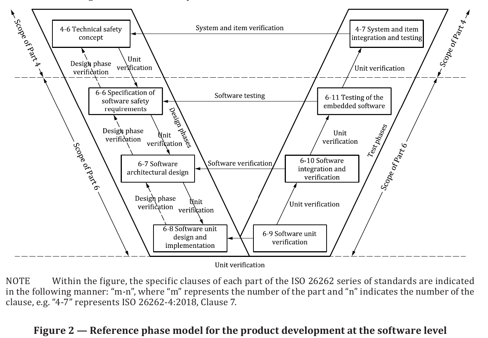

# ISO 26262 vs. Rust Gap Analysis

The ISO 26262 is a standard that is split into 13 parts. Management, System-level, Hardware-level, Software-Level and supporting.
Conformity to the ISO 26262 standard reached, by conforming to each single requirement. 
In the following for each clause of the Software part it is judged how well it is possible to conform to each requirement.
Most interesting is of course the Software part. But the context of the other parts matter.

Note: ISO 26262 allows for tailoring. If a requirement can't be met literally (ior doesn't make sense in the given context), it can be satisfied by providing a sound technical argumentation proving that the intent of the requirement is met or exceeded by other means. It is recommended to discuss that with the assessor apriori though.
The best way to describe the readiness is here along the reference phase model.

## 2 Management of FuSa

TODO

### 🟢 6-5 General topics for the product development at the software level

Table 1 — Topics to be covered by modelling and coding guidelines

| ID | Method | Solution: Rust Native or Tool | Readiness |
| :--- | :--- | :--- | :--- |
| **1a** | Enforcement of low complexity | `clippy::cyclomatic_complexity` | 🟢 |
| **1b** | Use of language subsets | Coding Guidelines (in progress) | 🟡 |
| **1c** | Enforcement of strong typing | inherent | 🟢 |
| **1d** | Use of defensive implementation techniques | possible e.g. Option'<T'>, Result<T, E> | 🟢 |
| **1e** | Use of well-trusted design principles | n.A. for Rust | n.A. |
| **1f** | Use of unambiguous graphical representation | n.A. for Rust | n.A. |
| **1g** | Use of style guides | clippy can enforce rules | 🟢 |
| **1h** | Use of naming conventions | clippy can enforce rules | 🟢 |
| **1i** | Concurrency aspects | native compile-time enforcable | 🟢 |

General considerations based on experience:

- IDE & Debugging support
    - dependent on target...

### 🟡 6-6 Safety requirements

- Traceability establishment from requiremets to implementation 🟢
    - Tooling exists: mantra
    - ... TODO

### 🟡 6-7 Software Architectural Design

Table 3 — Principles for software architectural design

| ID | Principle | Solution: Rust Native or Tool | Readiness |
| :--- | :--- | :---: | :---: |
| **1a** | Appropriate hierarchical structure of the software components | possible | 🟢 |
| **1b** | Restricted size and complexity of software components | possible | 🟢 |
| **1c** | Restricted size of interfaces $^a$ | possible | 🟢 |
| **1d** | Strong cohesion within each software component $^b$ | possible | 🟢 |
| **1e** | Loose coupling between software components $^{b,c}$ | possible | 🟢 |
| **1f** | Appropriate scheduling properties $^d$ | scheduler available (RTIC, ) - qualification unknown | 🟡 |
| **1g** | Restricted use of interrupts $^a$ | possible | 🟢 |
| **1h** | Appropriate spatial isolation of the software components | TBD | TBD |
| **1i** | Appropriate management of shared resources $^e$ | borrow checker/Mutexes available | 🟢 |

Table 4 — Methods for the verification of the software architectural design

| ID | Principle | Solution: Rust Native or Tool | Readiness |
| :--- | :--- | :---: | :---: |
| **1a** | Walk-through of the design $^a$ | n.A. for Rust | n.A. |
| **1b** | Inspection of the design $^a$ | n.A. for Rust | n.A. |
| **1c** | Simulation of dynamic behaviour of the design | n.A. for Rust | n.A. |
| **1d** | Prototype generation | n.A. for Rust | n.A. |
| **1e** | Formal verification | creusat, ... TBD | 🟡 |
| **1f** | Control flow analysis $^b$ | TBD | TBD |
| **1g** | Data flow analysis $^b$ | TBD | TBD |
| **1h** | Scheduling analysis | WCET available | 🟡 |

- Model based code generation tools 🔴
    - TODO: no tools exist so far afaik
- upper estimation of required resources? (execution time, storage, communication ressources)
    - TODO what exists here?

### 🟡 6-8 Software unit Design & Implementation

Table 6 — Design principles for software unit design and implementation

| ID | Principle | Solution: Rust Native or Tool | Readiness |
| :--- | :--- | :---: | :---: |
| **1a** | One entry and one exit point in subprograms and functions $^a$ | TBD clippy enforcable? panic handler? needs argumentation | TBD |
| **1b** | No dynamic objects or variables, or else online test during their creation $^a$ | use no_std, heapless, borrow checker | 🟢 |
| **1c** | Initialization of variables | TBD clippy enforcable | TBD |
| **1d** | No multiple use of variable names $^a$ | shadowing possible, TBD clippy enforcable | TBD |
| **1e** | Avoid global variables or else justify their usage $^a$ | TBD clippy enforcable | TBD |
| **1f** | Restricted use of pointers $^a$ | disallow safe rust - pointer usage discouraged | 🟢 |
| **1g** | No implicit type conversions $^a$ | inherent | 🟢 |
| **1h** | No hidden data flow or control flow | TBD clippy enforcable | TBD |
| **1i** | No unconditional jumps $^a$ | TBD clippy enforcable | TBD |
| **1j** | No recursions | TBD clippy enforcable | TBD |

- tbd: ARM FuSa Library support
- tbd: support of ARM Cortex R based microcontroller

### 🟡 6-9 Software unit verification

Table 7 — Methods for software unit verification

| ID | Method | Solution: Rust Native or Tool | Readiness |
| :--- | :--- | :---: | :---: |
| **1a** | Walk-through $^a$ | n.A. for Rust | n.A. |
| **1b** | Inspection $^a$ | n.A. for Rust | n.A. |
| **1c** | Pair-programming $^a$ | n.A. for Rust | n.A. |
| **1d** | Semi-formal verification | + | + |
| **1e** | Formal verification | o | o |
| **1f** | Control flow analysis $^{b,c}$ | + | + |
| **1g** | Data flow analysis $^{b,c}$ | + | + |
| **1h** | Static code analysis $^d$ | TBD partially clippy, TBD how far Coding Guidelines | 🟡 |
| **1i** | Static analyses based on abstract interpretation $^e$ | + | + |
| **1j** | Requirements-based test $^f$ | inherent cargo test | 🟢 |
| **1k** | Interface test $^g$ | inherent cargo test | 🟢 |
| **1l** | Fault injection test $^h$ | TBD | TBD |
| **1m** | Resource usage evaluation $^i$ | TBD | TBD |
| **1n** | Back-to-back comparison test $^j$ | TBD | TBD |

Table 9 — Structural coverage metrics at the software unit level

| ID | Method | Solution: Rust Native or Tool | Readiness |
| :--- | :--- | :---: | :---: |
| **1a** | Statement coverage | llvm/Tool TBD | 🟢 |
| **1b** | Branch coverage | llvm/Tool TBD | 🟢 |
| **1c** | MC/DC (Modified Condition/Decision Coverage) | no tool support yet | 🔴 |

- Coverage instrumentation 🟡
    - Exists for x86 
    - For embedded targets TBD
- General test tooling and report generation 🟢
    - inherently supported by cargo test
    - report generation TBD
- Tracebility tooling between test case definition and test case specification 🟡
    - TBD

### 🟡 6-10 Software unit integration & verification

Table 10 — Methods for verification of software integration

| ID | Method | Solution: Rust Native or Tool | Readiness |
| :--- | :--- | :---: | :---: |
| **1a** | Requirements-based test $^a$ | TBD | TBD |
| **1b** | Interface test | TBD | TBD |
| **1c** | Fault injection test $^b$ | TBD | TBD |
| **1d** | Resource usage evaluation $^{c, d}$ | TBD | TBD |
| **1e** | Back-to-back comparison test $^e$ | TBD | TBD |
| **1f** | Verification of the control flow and data flow | TBD | TBD |
| **1g** | Static code analysis $^f$ | TBD | TBD |
| **1h** | Static analyses based on abstract interpretation $^g$ | TBD | TBD |

Table 12 — Structural coverage at the software architectural level

| ID | Method | Solution: Rust Native or Tool | Readiness |
| :--- | :--- | :---: | :---: |
| **1a** | Function coverage $^a$ | llvm/Tool TBD | 🟢 |
| **1b** | Call coverage $^b$ | llvm/Tool TBD | 🟢 |

### 🟡 6-11 Testing embedded software

Table 14 — Methods for tests of the embedded software

| ID | Method | Solution: Rust Native or Tool | Readiness |
| :--- | :--- | :---: | :---: |
| **1a** | Requirements-based test | TBD | TBD |
| **1b** | Fault injection test $^a$ | TBD | TBD |

### Annex C

## 🔴 8 Supporting Processes

- Tool Qualification 🔴
    - TODO: keep in mind the usage of tools requires tool qualification. Depending on your usage, context, processes, this might require you to qualify the tool.