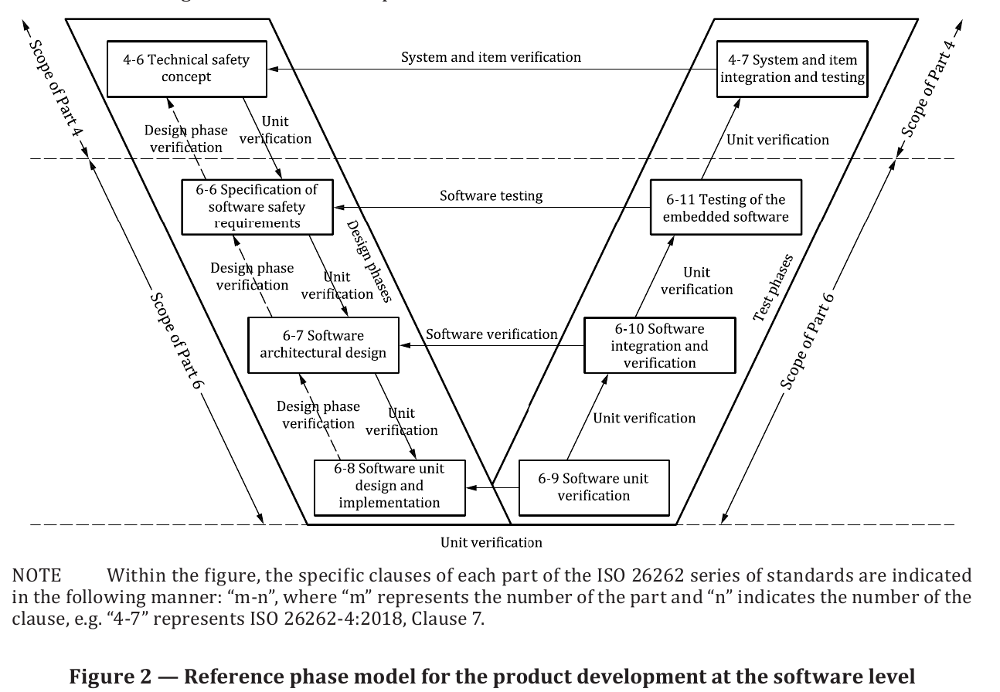

# ISO 26262 vs. Rust Gap Analysis

ISO 26262 is a standard comprising 12 parts, covering Management, System-level, Hardware-level, Software-Level, and Vocabulary/Supporting/Guidelines.
Compliance to the standard can be claimed by fulfilling each single requirement, unless it has been tailored according to part 2 or a sound technical rationale is given.

The following analysis evaluates the readiness of Rust to meet the requirements of Part 6: "Product development at the software level.", following the Software Reference Phase Model (V-Model) and corresponding clauses. The structure is based around the normative tables and an additional section on "general considerations" for each clause. These considerations are derived from practical experience and address indirect requirements or ecosystem constraints - while not not explicitly mentioned in the standard are critical for successful implementation.

Please feel free to contribute any missing points.
Note: In the list a few tools are mentioned - a curated list of tools for safety-critical developments in Rust are curated [by the Tooling subcommittee](https://github.com/rustfoundation/safety-critical-rust-consortium/tree/main/subcommittee/tooling/tool-list).

### 🟢 6-5 General topics for the product development at the software level

Table 1 — Topics to be covered by modelling and coding guidelines

| ID | Method | Solution: Rust Native or Tool | Readiness |
| :--- | :--- | :--- | :--- |
| **1a** | Enforcement of low complexity | (Process) **statically enforceable** by unqualified clippy tool e.g. cyclomatic_complexity | 🟢 |
| **1b** | Use of language subsets | (Language) **coding guidelines** (are in progress by Subcommittee) | 🟡 |
| **1c** | Enforcement of strong typing | (Language) **inherent** feature of Rust | 🟢 |
| **1d** | Use of defensive implementation techniques | (Architecture) **encouraged** by use of Types `Option"`, `Result`, etc. but is generally designed. | 🟢 |
| **1e** | Use of well-trusted design principles | (Architecture) **encouraged** by Rust inherent features like encapsulation and RAII by default, but engineer must actively use those | 🟢 |
| **1f** | Use of unambiguous graphical representation | (Process) **not available** for Rust code specifically | 🔴 |
| **1g** | Use of style guides | (Process) **statically enforceable** by unqualified clippy tool | 🟢 |
| **1h** | Use of naming conventions | (Process) **statically enforceable** by unqualified clippy tool | 🟢 |
| **1i** | Concurrency aspects | (Architecture) **partially** concurrent aspects can be enforced by Rust such as borrow checker on shared resources. Typical constructs such as Mutex, RefCells to provide guarantees also exist - but e.g. priority inversion, deadlocks etc. are still possible managed by the architect (TODO: anything missing?) | 🟡 |

General considerations outside of tables based on experience:

- Rust achieves requirement 5.4.2 The criteria that shall be considered when selecting a design, modelling or programming language are: 🟢
    - an unambiguous and comprehensible definition; 🟢
    - suitability for specifying and managing safety requirements according to ISO 26262-8:2018 if modelling is used for requirements engineering and management; 🔴 (no model-based Rust code generation available)
    - support the achievement of modularity, abstraction and encapsulation; and 🟢
    - support the use of structured constructs. 🟢
- Coding Guidelines 🟡
    - [Safety-Critical Rust Coding Guidelines](https://github.com/rustfoundation/safety-critical-rust-coding-guidelines) are in active work
    - need to be complemented by individual/organizational-specific guidelines
    - Tool "clippy" can be used to enforce guidelines (but is not qualified)
- IDEs 🟢
    - Multiple Supported IDEs with all common features: e.g. VSCode, JETBRAINS RustRover, ...
- Debugging and tracing support 🟡
    - Multiple tools available for debugging on target for ARM, RISC V, AURIX, (e.g. probe-rs, knurling-rs)
    - Tracing Lauterbach TRACE32 (TODO: has anyone experience?)
    - TODO: Anything missing?
- Build system & CI/CD 🟢
    - (unqualified) cargo inherently allows to configure different runners
    - Tests are encouraged to be written alongside the code
    - Well supported by commonly available (unqualified) build systems (e.g. Jenkins, etc.)
- Qualified Compiler 🟢
    - Multiple available for up to ASIL D for multiple targets (e.g. Hightec, Ferrocene)

### 🟡 6-6 Specification of software safety requirements

General considerations outside of tables based on experience:

- Traceability 🟢
    - Multiple tools supported convenient requirement traceability to implementation (e.g. sphinx-needs, mantra)
- Automated traceability report generation 🟢
    - Supported by some tools (e.g. sphinx-needs, mantra)

### 🟡 6-7 Software architectural design

Table 2 on software architecture notations is omitted, because it has no direct impact by/for using Rust.

Table 3 — Principles for software architectural design

| ID | Principle | Solution: Rust Native or Tool | Readiness |
| :--- | :--- | :--- | :--- |
| **1a** | Appropriate hierarchical structure of the software components | (Architecture) **neutral** Rust does not impose this logical design constraint | 🟢 |
| **1b** | Restricted size and complexity of software components | (Architecture) **neutral** Rust does not impose this logical design constraint | 🟢 |
| **1c** | Restricted size of interfaces | (Architecture) **neutral** Rust does not impose this logical design constraint | 🟢 |
| **1d** | Strong cohesion within each software component | (Architecture) **neutral** Rust does not impose this logical design constraint | 🟢 |
| **1e** | Loose coupling between software components | (Architecture) **neutral** Rust does not impose this logical design constraint | 🟢 |
| **1f** | Appropriate scheduling properties | (Architecture) **partially available** multiple unqualified native Rust scheduler or "RTOS" available - but support for other foreign RTOS/Scheduler available e.g. VxWorks, QNX. | 🟡 |
| **1g** | Restricted use of interrupts | (Architecture) **neutral** Rust does not impose this constraint | 🟢 |
| **1h** | Appropriate spatial isolation of the software components | (Architecture + Compiler) Logical isolation: Rust natively enforces strict visibility rules and memory safety but physical isolation requires hardware MPU/MMU that requires Rust drivers (TODO: I haven't seen this well supported yet?) | 🟡 |
| **1i** | Appropriate management of shared resources | (Architecture) **available** Safe Rust makes Data Races impossible, using Borrow Checker on e.g. hardware peripheral access and provides Mutexes, RwLocks etc. - logical deadlocks are still possible and must be managed by the architect (TODO: anything missing?) | 🟢 |

Table 4 — Methods for the verification of the software architectural design

| ID | Principle | Solution: Rust Native or Tool | Readiness |
| :--- | :--- | :--- | :--- |
| **1a** | Walk-through of the design | (Process) **neutral** Rust code is generally easy to read and inspect (TODO: is that a fair claim? ofc depends on individual code quality) | 🟢 |
| **1b** | Inspection of the design | (Process) **neutral** Rust code is generally easy to read and inspect | 🟢 |
| **1c** | Simulation of dynamic behavior of the design | (Tools) **not available** with native support - this is generally regarding model-based designs. To simulate embedded behavior unqualified Renode can give insights but doesn't provide strong evidences. (TODO: any other ideas here?) | 🔴 |
| **1d** | Prototype generation | (Process) **neutral** you can test your Rust applications early | 🟢 |
| **1e** | Formal verification | (Tools) **partially available** unqualified tools exist, e.g. creusot or kani, but quality unknown (TODO: has anyone experience?) | 🟡 |
| **1f** | Control flow analysis | (Tools) **not available**: (TODO: not aware of any tools) | 🔴 |
| **1g** | Data flow analysis | (Tools) **not available**: (TODO: not aware of any tools) | 🔴 |
| **1h** | Scheduling analysis | (Tools) **partially** WCET analysis tool available (TODO: anything missing?) | 🟡 |

General considerations outside of tables based on experience:

- Model based code generation tools 🔴
    - No tools exist here at the moment
- Software partitioning and freedom from interference TODO
    - (TODO: I have no experience with Rust here - anyone?)
- Upper estimation of required resources (execution time, storage, communication resources) 🔴
    - (TODO: not aware of any tools) 
- C Interoperability 🟡
    - Legacy Code, vendor SDKs or specific drivers might require C-code
    - the boundary (e.g. bindgen) is generally unqualified and needs to be verified individually

### 🟡 6-8 Software unit design and implementation

Table 5 on unit design notations is omitted, because it has no direct impact by/for using Rust.

Table 6 — Design principles for software unit design and implementation

| ID | Principle | Solution: Rust Native or Tool | Readiness |
| :--- | :--- | :--- | :--- |
| **1a** | One entry and one exit point in subprograms and functions | (Architecture) **possible, not encouraged** Rust idiomatically uses multiple exits (via early return or the ? error propagation operator) (TODO: this should be acceptable depending on context & assessor or otherwise forbidden and enforced by static checks) | 🟡 |
| **1b** | No dynamic objects or variables, or else online test during their creation | (Architecture) **encouraged** by use of no_std and unqualified heapless library exists | 🟡 |
| **1c** | Initialization of variables | (Language) **inherent** feature, safe Rust doesn't allow reading uninitialized variables | 🟢 |
| **1d** | No multiple use of variable names | (Language) **inherent** Rust encourages variables shadowing, but can clippy can disallow it (clippy::shadow_reuse) | 🟢 |
| **1e** | Avoid global variables or else justify their usage | (Language) **inherent** feature of safe Rust, mutable global variables are considered unsafe | 🟢 |
| **1f** | Restricted use of pointers | (Language) **inherent** feature of safe Rust, | 🟢 |
| **1g** | No implicit type conversions | (Language) **inherent** enforced of safe Rust | 🟢 |
| **1h** | No hidden data flow or control flow | TODO | TODO |
| **1i** | No unconditional jumps | (Language) **inherent** feature of Rust: no goto support | 🟢 |
| **1j** | No recursions | (Architecture) **statically enforceable** Rust allows recursions. Rule needs enforcement by static checks (TODO: no existing clippy lint exist so far) | 🟡 |

General considerations outside of tables based on experience:

- FuSa Library support for qualified microcontroller 🟡
    - e.g. ARM Self Test Library support to provide diagnostic coverage for microcontroller exists only in C (TODO: has anyone used those?)
    - are generally provided as binary blobs or C-files and require FFI (which might tamper qualification)
- Support of ARM Cortex R based microcontroller by HALs 🔴
    - afaik not much existing here at the moment (TODO: anyone knows more here?)
- Qualified RTOS/Frameworks 🔴
    - There is a ongoing effort e.g. for OxidOS
    - RTIC, embassy, Tock etc. are neither qualified nor stable (TODO: anyone knows more here?)
    - VxWorks, QNX are partially supported (TODO: I assume qualification does not encompass the interface Rust and C/C++ RTOS)
- Panic Handling 🟢
    - A panic_handler must be defined to reset the system safely

### 🟡 6-9 Software unit verification

Table 7 — Methods for software unit verification

| ID | Method | Solution: Rust Native or Tool | Readiness |
| :--- | :--- | :--- | :--- |
| **1a** | Walk-through | (Process) **neutral** Rust code is generally easy to read and inspect | 🟢 |
| **1b** | Inspection | (Process) **neutral** Rust code is generally easy to read and inspect | 🟢 |
| **1c** | Pair-programming | (Process) **neutral** no impact by Rust | 🟢 |
| **1d** | Semi-formal verification | (Tools) **TODO** (TODO: depends on context if e.g. tests can be generated based on UML specifications) | 🔴 |
| **1e** | Formal verification | (Tools) **partially available** unqualified tools exist, e.g. creusot or kani, but quality unknown (TODO: has anyone experience?) | 🟡 |
| **1f** | Control flow analysis | (Tools) **not available** afaik (TODO: does anyone know more?) | 🔴 |
| **1g** | Data flow analysis | (Tools) **not available** afaik (TODO: does anyone know more?) | 🔴 |
| **1h** | Static code analysis | (Tools) **exists** unqualified clippy is standard - but is missing checks from all coding-guidelines | 🟡 |
| **1i** | Static analyses based on abstract interpretation | (Tools) **not available** (TODO: lacking support for tools like Polyspace or Astree) | 🔴 |
| **1j** | Requirements-based test | (Tools) **available** cargo test handles execution. Traceability to requirements requires tool as e.g. sphinx-needs or mantra | 🟢 |
| **1k** | Interface test | (Tools) **available** cargo test handles execution. Traceability to interface specifications requires external tools | 🟢 |
| **1l** | Fault injection test | (Tools) **not available** tool support on embedded targets, requires manually code injections (TODO: does anyone know more?) | 🟡 |
| **1m** | Resource usage evaluation | (Tools) **tools exist** e.g. Orbuculum or TRACE32 by Lauterbach, but unclear how well it works (TODO: any experience?) | 🟡 |
| **1n** | Back-to-back comparison test | (Tools) **not available** requires model generators to support Rust and export test vectors | 🔴 |

Table 8 on test case derivation methods is omitted, because it is typically a manual effort and has no direct impact by/for using Rust.

Table 9 — Structural coverage metrics at the software unit level

| ID | Method | Solution: Rust Native or Tool | Readiness |
| :--- | :--- | :--- | :--- |
| **1a** | Statement coverage | **available** by llvm | 🟢 |
| **1b** | Branch coverage | **available** by llvm | 🟢 |
| **1c** | MC/DC (Modified Condition/Decision Coverage) | **not available** yet, is in discussions | 🔴 |

General considerations outside of tables based on experience:

- Coverage instrumentation for embedded 🔴
    - Exists for x86
    - Missing for embedded targets (TODO: or is anyone aware?)
- General test tooling and report generation 🟡
    - test runner inherent feature by cargo test
    - custom runner can be configured to run on embedded targets (e.g. by defmt-test by knurling-rs)
- Demonstrate equivalence between target/test environment and object code, when unit tests are not performed on target 🔴
    - No information available (TODO: does anyone have hints here?)
- Traceability between test case implementation and test case specification 🟡
    - TODO: does this exist? Does mantra make this possible?
    - TODO: automatic traceability/test report and statistics generation?

### 🟡 6-10 Software unit integration and verification

Table 10 — Methods for verification of software integration

| ID | Method | Solution: Rust Native or Tool | Readiness |
| :--- | :--- | :--- | :--- |
| **1a** | Requirements-based test | (Tools) **available** cargo test handles execution. Traceability to requirements requires tool as e.g. sphinx-needs or mantra. knurling-rs allows tests to run on target | 🟢 |
| **1b** | Interface test | (Tools) **available** cargo test handles execution. Traceability to interface specifications requires external tools. knurling-rs allows tests to run on target | 🟢 |
| **1c** | Fault injection test | (Tools) **not available** tool support on embedded targets, requires manually code injections (TODO: does anyone know more?) | 🟡 |
| **1d** | Resource usage evaluation | (Tools) **exist** e.g. (unqualified) Orbuculum or TRACE32 by Lauterbach, but unclear how well it works (TODO: any experience?) | 🟡 |
| **1e** | Back-to-back comparison test | (Tools) **not available** requires qualified model generators to support Rust and export test vectors | 🔴 |
| **1f** | Verification of the control flow and data flow | (Tools) **not available** | 🔴 |
| **1g** | Static code analysis | (Process) **exists** clippy is standard - but is missing checks from all coding-guidelines | 🟡 |
| **1h** | Static analyses based on abstract interpretation | (Tools) **not available** (TODO: lacking support for tools like Polyspace or Astree) | 🔴 |

Table 12 — Structural coverage at the software architectural level

| ID | Method | Solution: Rust Native or Tool | Readiness |
| :--- | :--- | :--- | :--- |
| **1a** | Function coverage | (Tools) **supported** by llvm | 🟢 |
| **1b** | Call coverage | (Tools) **supported** by llvm | 🟢 |

For general testing-related considerations see 6-9, no specifics for integration testing.

### 🟡 6-11 Testing of the embedded software

Table 14 — Methods for tests of the embedded software

| ID | Method | Solution: Rust Native or Tool | Readiness |
| :--- | :--- | :--- | :--- |
| **1a** | Requirements-based test | (Tools) **available** cargo test handles execution. Traceability to requirements requires tool as e.g. sphinx-needs or mantra. knurling-rs allows tests to run on target | 🟢 |
| **1b** | Fault injection test | (Tools) **not available** tool support on embedded targets, requires manually code injections | 🟡 |

For general testing-related considerations see 6-9, no specifics for embedded testing.

### 🟡 Annex C (normative) Software configuration

Table C.1: Mechanisms for the detection of unintended changes of data

| ID | Method | Solution: Rust Native or Tool | Readiness |
| :--- | :--- | :--- | :--- |
| **1a** | Plausibility checks on calibration data | (Architecture) **neutral** needs to be implemented manually | 🟢 |
| **1b** | Redundant storage and comparison of calibration data | (Architecture) **not available** qualified libraries for redundant storage and checks of data e.g. by encoding boolean as specific bit pattern (10101010) to easier catch overrides not available (TODO: does anyone know more) | 🟡 |
| **1c** | Calibration data checks using error detecting codes | (Architecture) **partially available** unqualified crate to calculate e.g. CRCs available - qualified PAC for CRC engines not available | 🟡 |

General considerations outside of tables based on experience:

- TODO

## 🔴 8 Supporting Processes

- 11 Tool Qualification 🔴
    - Tools being used during the development/operation need to have undergone Tool Qualification as per ISO 26262-8 clause 11)
    - Most of the open source tools mentioned before are not qualified
    - Where not (sufficiently) available, this has to be individually performed based on the usage context
- 12 Qualification of software components 🔴
    - Qualification of software components used within the product needs to be performed as per ISO 262626-8 clause 12
    - Most of the open RTOS, PACs, HALs, crates/libraries etc. are not qualified and thus can't be directly used within the product
    - Where these are not qualified, this has to be individually performed based on the usage context

Note: unqualified Tools/Software components are partially rated as yellow or green - depending on gut-feel difficulty on actual impact
