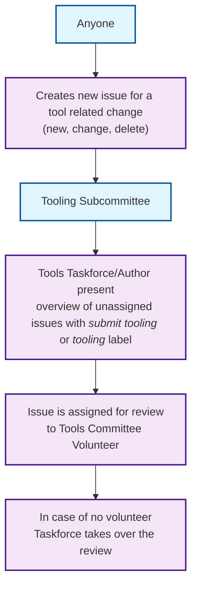
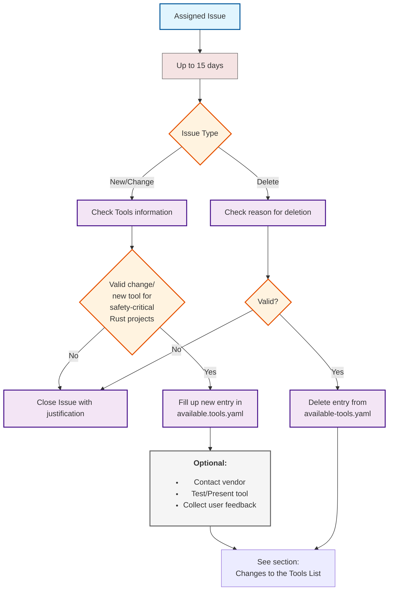
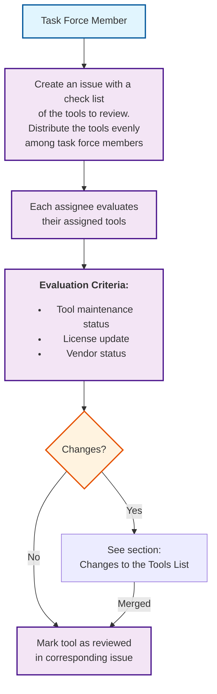
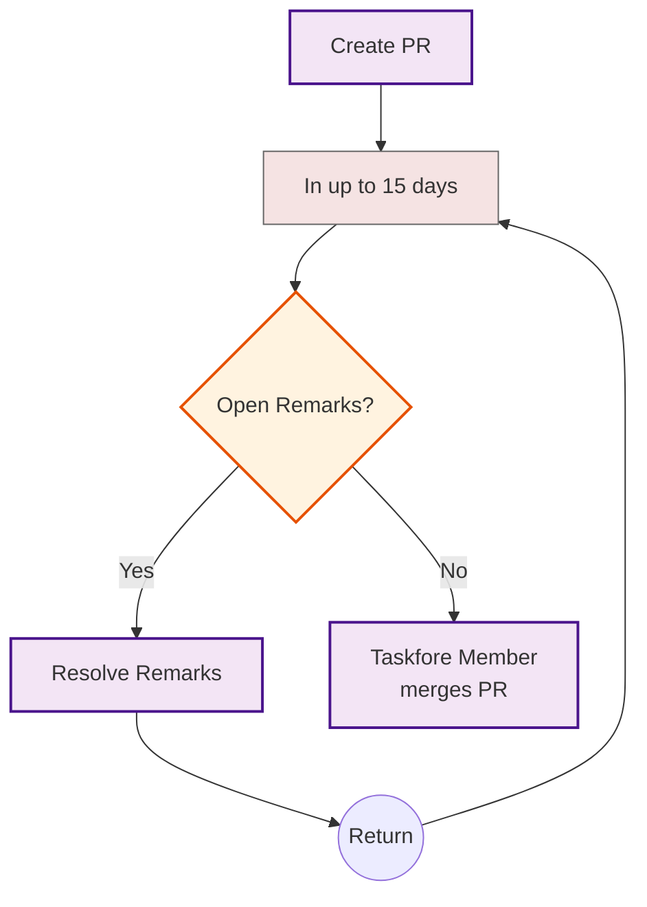

# Tools List Maintenance Flows

This section defines how the tools list is managed by the tooling subcommittee.

## TLDR

The tool proposal consists of three main phases:

### 1. **Assigning Phase**

- Anyone can create issues to request changes related to the tools list (add, change, delete)
- Tooling Committee manages the process
- Tools Taskforce presents unassigned issues marked with a `submit tooling` or `tooling` label
- Issues are assigned to volunteers or taken over by the Taskforce

### 2. **Review New Issues**

- **New/Change Path**: 15-day review period including:
  - Tool information checking
  - Entry creation in [available-tools.yaml]
  - Optional: vendor contact, testing, and user feedback collection
- **Delete Path**: Review deletion reasoning
- **Common validation**: Valid requests proceed to PR creation and merge process
- **PR Process**: Includes remark resolution cycle if needed

### 3. **Review Complete List (Annually)**

- Task Force Member initiates annual review of tools listed in available.tools.yaml
- Tools to review distributed evenly among assessors
- Evaluation based on:
  - Tool maintenance status
  - License updates
  - Vendor status
- Changes feed back into the PR creation process

## Assigning New Issues Related to the Tools List

This flowchart defines how new tools list related issues are assigned to subcommittee members:

## Review New Issues

This flowchart defines how issues are reviewed by assignees:

## "Once a Year" Review

This flowchart defines how the "Once a Year" review of the tools list is handled:

## Changes to the Tools List

This flowchart defines how changes to the tools list are handled:

