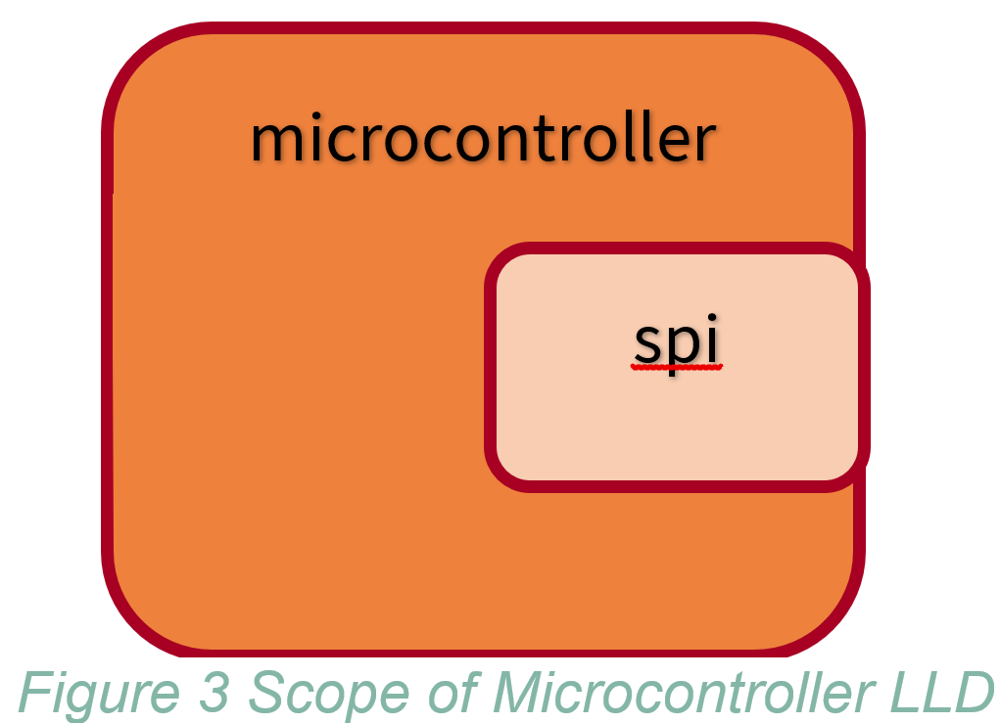
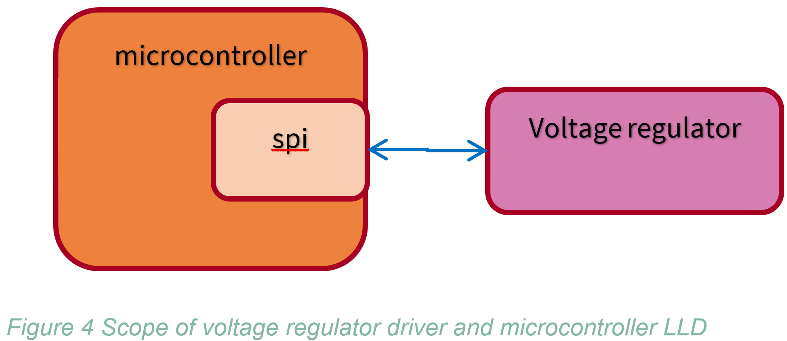

# Rust Embedded Low Level Drivers (LLD) and Safe Definition

- [Rust Embedded Low Level Drivers and Safe Definition](#markdown-header-rust-embedded-low-level-drivers-and-safe-definition)
  - [Introduction](#markdown-header-introduction)
  - [What does mean safe for Rust language.](#markdown-header-what-does-mean-safe-for-rust-language)
    - [What is “undefined behavior” in Rust?](#markdown-header-what-is-undefined-behavior-in-rust)
  - [Hardware undefined behavior](#markdown-header-hardware-undefined-behavior)
  - [Rust safe/unsafe are not well defined when hardware is involved.](#markdown-header-rust-safeunsafe-are-not-well-defined-when-hardware-is-involved)
    - [Svd2rust](#markdown-header-svd2rust)
    - [Is safe and unsafe not applicable to external world?](#markdown-header-is-safe-and-unsafe-not-applicable-to-external-world)
  - [Proposal](#markdown-header-proposal)
    - [Example](#markdown-header-example)
  - [Conclusions](#markdown-header-conclusions)

## Introduction

Any real system is not just composed by a CPUs, memories and software.
In a real system there are other hardware components that shall interact
with software. They are usually called peripherals.

Peripheral examples:

  - UART
  - GPU
  - DMA
  - Ethernet
  - Timers
  - Watchdog

Peripherals are typically configured and operated by reading memory
mapped registers or in some cases using special CPU instructions.

Peripheral configuration and operation could be complex and cumbersome
and for this reason an embedded software developer doesn't interact
directly with registers but through a low-level drivers. Low-level
drivers typically don`t support portability across different type of
microcontrollers but they implement a minimal logic to configure and
operate properly the device accordingly with microcontroller or
microprocessor specification.

Rust developers expect to use safe libraries or more exactly libraries
that doesn`t have unsafe API.

When I tried to understand what need to be done to offer safe low level
drivers, I found that there is no clear definition of what does mean
`safe` or `unsafe` when hardware is involved.

In this document, I try to analyze the reason of this unclarity and
propose a solution.

Before to proceed to this analysis we need to understand what does mean
`safe` for Rust language:

## What does mean safe for Rust language.

Rust is considered a safe language and the terms `safe` and `unsafe` are
widely used in its documentation.

What does mean `safe` in the context of Rust? I was not able to find a
good definition of what is safe in Rust but there is quite clear
definition of what shall be considered `unsafe` in Rust.

In Rust Ferrocene specification is written the following [^1]:

*Unsafety is the presence of unsafe operations in program text.*

*An unsafe operation is an operation that may result in undefined
behavior that is not diagnosed as a static error. Unsafe operations are
referred to as unsafe Rust.*

This definition is aligned with what is written in Rustnomicon[^2]:

*No matter what, Safe Rust can't cause Undefined Behavior.*

Moreover, the keyword `unsafe` is used in multiple context[^3]:

  - *unsafe fn*: calling this function means abiding by a contract the
    compiler cannot enforce.

  - *unsafe trait*: implementing the trait means abiding by a contract
    the compiler cannot enforce.

  - *unsafe {}*: the contract necessary to call the operations inside
    the block has been checked by the programmer and is guaranteed to be
    respected.

  - *unsafe impl*: the contract necessary to implement the trait has
    been checked by the programmer and is guaranteed to be respected.

This discussion only covers unsafe blocks and unsafe functions. Unsafe
functions can be called only in unsafe blocks and the user shall ensure
to use unsafe functions fulfilling all requirements described in the
documentation to avoid undefined behavior.

This simplifies code review and bug identification. The developers shall
inspect first unsafe blocks in case the application shows an undefined
behavior. However, this doesn`t exclude that a function developer forgot
to mark a function as “unsafe”.

### What is “undefined behavior” in Rust? 

Ferrocene specification defines it as “unbounded error”[^4] or in other
words: everything could happen.

Rust Reference manual provide a non-exhaustive list of “undefined
behaviors”[^5] The following behavior are worth mentioning because it
involves hardware:

  - *Executing code compiled with platform features that the current
    platform does not support (see target\_feature), except if the
    platform explicitly documents this to be safe.*

Before discussing safe/unsafe in Low Level Drivers let`s see the meaning
of “undefined behavior” in the context of microcontroller/microprocessor
hardware.

## Hardware undefined behavior

In many data sheet or user manual of micro-controller and microprocessor
is used the term *undefined behavior* and in these documents is
described how to avoid the conditions that could generate an undefined
behavior.

What does mean *undefined behavior* in the context of microcontrollers
or microprocessor?

  - undefined behavior is not tested in simulation and in production.
    
      - Any behavior could happen.

  - undefined behavior can be different from device to device.

  - undefined behavior can be different at different instance of time.

The last two characteristic it is very true for mixed signal peripherals
and for clock system of microcontroller due to sensitivity to physical
conditions of device and surrounding environments (e.g., variance of
process manufacturing, operating temperature…). Therefore, undefined
behavior is the worst-case scenario and there is no software test that
can detect it.

It shall be highlighted that an undefined behavior could be triggered
not only by wrong value of registers but also by wrong order of reading
and writing of registers.

## Rust safe/unsafe are not well defined when hardware is involved.

From previous discussion it could appear obvious that safe low level
drivers shall protect from any misuses that could trigger undefined
behavior even from hardware.

Unfortunately, this is not generally accepted and there are different
understandings. Let`s list them:

### Svd2rust

Svd2Rust[^6] generated peripheral access crates (PAC) from xml register
description. Peripheral access crates provides API to write and read
peripheral registers.

Safe functions provided by generated crates protect users from following
issue:

  - Writing out of range value for bitfields.

  - Concurrent access to same register from different interrupt/thread

  - Read or write registers that cannot be read or written.

_These functions cannot protect from undefined
behavior triggered by improper order of calling functions_.

e.g. Clock initialization, peripheral initialization.

This approach seems conflicting with other approach:

  - In Embedonomicon is described how to create safe API for DMA low
    level driver[^7]. Why shall I take all these measures if all my
    register access API are safe?

  - All C library all functions are by considered by default unsafe. Why
    a very low level access to external HW function is considered safer
    than accessing a C library.

On svd2rust and safety there is an ongoing discussion in an issue of
GitHub project[^8] related to this topic.

### Is safe and unsafe not applicable to external world?

I have talked with some developers, and they don`t consider relevant HW
undefined behavior because are not part of Rust developed software. In
other words, they assume that unsafety shall be restricted to only rust
code memory issues, thread issue but not to HW component.

This position is similar to the one regarding the safety of *fs::open*
in Unix system[^9]. The *fs::open* is considered safe function even if
it can open special file */proc/self/mem* that allows unchecked full
access to process memory. Moreover, it is stated the following in the
documentation:

*Rust`s safety guarantees only cover what the program itself can do, and
not what entities outside the program can do to it.*

However, I still see the same conflicting usage of unsafe as in the
previous chapter:

  - C API are by default unsafe. Are not referring to external C
    program? If the previous definition holds, they should be considered
    safe.

  - HW undefined behavior is already included in Rust Reference:
    “*Executing code compiled with platform features that the current
    platform does not support*”.

  - Measures required for safe DMA API in Embednomicon. DMA is external
    to Rust program but measures are taken to have safe API.
    
## Proposal

I think it is quite clear that a clear unambiguous and widely accepted
definition of undefined behavior in Rust language especially when HW is
involved is missing.

While waiting for a vastly better definition in an upcoming Rust
specification, I would propose the following to solve this issue:

  - HW undefined behavior shall be considered when developing low level
    drivers.

  - In the documentation of safe API shall be stated the scope of
    safety: which part of the system is free of undefined behavior.
    
### Example

Let`s assume a system where a microcontroller is connected to a voltage
regulator that is the power supply of microcontroller and a software
running in microcontroller changes the voltage and clock based on
required system mode.

Software is structured as in the below picture. All components provide
safe API.

For each software component shall be documented which part of system is
considered regarding undefined behavior.

Microcontroller low level driver should provide safe API only
considering just the microcontroller but excluding the voltage regulator
because they should be generic and usable for any system.

Voltage regulator driver requires a SPI low level driver in order and
their combination shall protect from undefined behavior that could arise
from microcontroller + voltage regulator. Voltage regulator driver is
supposed to be generic and independent of the device connected to the
output of voltage regulator.

Finally, system mode manager API shall guarantee the freedom from
undefined behavior of full system as described in Figure 1 HW system.

## Conclusions

In this document I tried to show why the measures required to have safe
LLD are not clear. The reason roots down to the definition of “undefined
behavior”. This is a call for Rust community and Rust specification
writers to have an unambiguous and well-defined description of
“undefined behavior” that includes HW drivers.

I described a proposal inspired by ISO23232 out of context element that
is applicable to LLD and still preserve one of the main advantages of
Rust:

*No matter what, Safe Rust can't cause Undefined Behavior.*

[^1]: https://spec.ferrocene.dev/unsafety.html
[^2]: https://doc.rust-lang.org/nomicon/safe-unsafe-meaning.html
[^3]: https://doc.rust-lang.org/std/keyword.unsafe.html#the-different-meanings-of-unsafe
[^4]: https://spec.ferrocene.dev/glossary.html#term_undefined_behavior
[^5]: https://doc.rust-lang.org/reference/behavior-considered-undefined.html
[^6]: https://docs.rs/svd2rust/latest/svd2rust/
[^7]: https://docs.rust-embedded.org/embedonomicon/dma.html
[^8]: https://github.com/rust-embedded/svd2rust/issues/714
[^9]: https://doc.rust-lang.org/std/os/unix/io/index.html#procselfmem-and-similar-os-features
