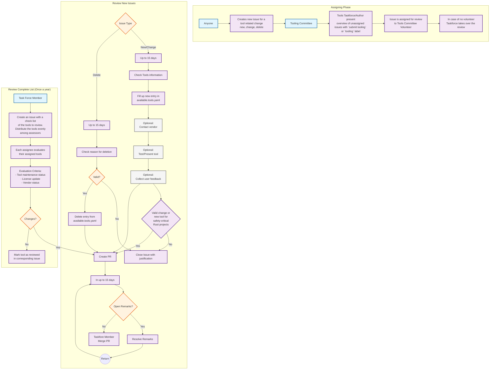

## RFC4Tools Review Process

This Mermaid diagram represents the RFC4Tools review workflow with three main phases:

### 1. **Assigning Phase**
- Anyone can create issues for tool changes (new, change, delete)
- Tooling Committee manages the process
- Tools Taskforce presents unassigned issues marked with a `submit tooling` or `tooling` label
- Issues are assigned to volunteers or taken over by the Taskforce

### 2. **Review New Issues**
- **New/Change Path**: 15-day review period including:
  - Tool information checking
  - Entry creation in available.tools.yaml
  - Optional: vendor contact, testing, and user feedback collection
- **Delete Path**: Review deletion reasoning
- **Common validation**: Valid requests proceed to PR creation and merge process
- **PR Process**: Includes remark resolution cycle if needed

### 3. **Review Complete List (Annual)**
- Task Force Member initiates annual review
- Tools to review distributed evenly among assessors
- Evaluation based on:
  - Tool maintenance status
  - License updates
  - Vendor status
- Changes feed back into the PR creation process
